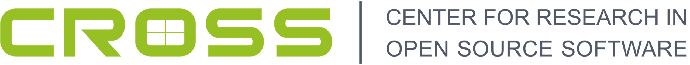

# Open Source Project Ideas

This list of projects are meant for student and other up-and-coming developers interested in contributing to participating Universiy of California-based open source projects. The list below notes the UC-based open source project and ideas associated to each that were submitted by a UC-affiliated mentor. If you have any questions, please visit our Gitter channel: 

Table of Contents:

<!--ts-->
* [Open Source Project Ideas](#open-source-project-ideas)
   * [LiveHD](#livehd)
      * [HIF Tooling](#hif-tooling)
      * [Mockturtle](#mockturtle)
      * [Query Shell](#query-shell)
      * [Lgraph and LNAST check pass](#lgraph-and-lnast-check-pass)
      * [unbitwidth](#unbitwidth)
   * [Eusocial Storage Devices](#eusocial-storage-devices)
      * [Dynamic function injection for RocksDB](#dynamic-function-injection-for-rocksdb)
      * [Demonstrating a composable storage system accelerated by memory semantic technologies](#demonstrating-a-composable-storage-system-accelerated-by-memory-semantic-technologies)
   * [SmartNICs](#smartnics)
      * [Employ kernel-bypass techniques in Apache Arrow Flight](#employ-kernel-bypass-techniques-in-apache-arrow-flight)
      * [Arrow data filtering using regular expression accelerator](#arrow-data-filtering-using-regular-expression-accelerator)
   * [Open Source Autonomous Vehicle Controller](#open-source-autonomous-vehicle-controller)
      * [Vehicle/Craft sensor driver development](#vehiclecraft-sensor-driver-development)
      * [Path finding algorithm using OpenCV and machine learning](#path-finding-algorithm-using-opencv-and-machine-learning)
      * [State estimation/sensor fusion algorithm development](#state-estimationsensor-fusion-algorithm-development)
   * [SkyhookDM](#skyhookdm)
      * [Support reading from Skyhook in Dask/Ray using the Arrow Dataset API](#support-reading-from-skyhook-in-daskray-using-the-arrow-dataset-api)
      * [Implement Gandiva based query executor in SkyhookDM](#implement-gandiva-based-query-executor-in-skyhookdm)
      * [Add Ability to create and save views from Datasets](#add-ability-to-create-and-save-views-from-datasets)
      * [Integrating Delta Lake on top of SkyhookDM](#integrating-delta-lake-on-top-of-skyhookdm)
   * [Proactive Data Containers (PDC)](#proactive-data-containers-pdc)
      * [Python interface to an object-centric data management system](#python-interface-to-an-object-centric-data-management-system)
   * [CephFS](#cephfs)
      * [CephFS namespace traversal offloading](#cephfs-namespace-traversal-offloading)
   * [OpenROAD - A Complete, Autonomous RTL-GDSII Flow for VLSI Designs](#openroad---a-complete-autonomous-rtl-gdsii-flow-for-vlsi-designs)
      * [OpenLane Memory Design Macro Floorplanning](#openlane-memory-design-macro-floorplanning)
      * [OpenLane Memory Design Timing Analysis](#openlane-memory-design-timing-analysis)
      * [OpenLane Memory Macro PDK Support](#openlane-memory-macro-pdk-support)
      * [VLSI Power Planning and Analysis](#vlsi-power-planning-and-analysis)
      * [Demos and Tutorials](#demos-and-tutorials)
      * [Comprehensive Flow Testing](#comprehensive-flow-testing)
      * [Enhance GUI features](#enhance-gui-features)
      * [Automate OpenDB code Generation](#automate-opendb-code-generation)
      * [Implement an NLP based AI bot aimed at increasing users, enhancing usability and building a knowledge base](#implement-an-nlp-based-ai-bot-aimed-at-increasing-users-enhancing-usability-and-building-a-knowledge-base)
   * [Package Management &amp; Reproducibility](#package-management--reproducibility)
      * [Investigate the dynamic linking landscape](#investigate-the-dynamic-linking-landscape)
   * [Apache AsterixDB](#apache-asterixdb)
      * [Geospatial Data Science on AsterixDB](#geospatial-data-science-on-asterixdb)
         * [The goals of this project are:](#the-goals-of-this-project-are)
         * [Machine Learning Integration](#machine-learning-integration)
   * [FasTensor](#fastensor)
      * [Continuous Integration](#continuous-integration)
   * [Polyphorm / PolyPhy](#polyphorm--polyphy)
      * [Develop website for PolyPhy](#develop-website-for-polyphy)
      * [Design visual experience for PolyPhy's website and presentations](#design-visual-experience-for-polyphys-website-and-presentations)
      * [Write PolyPhy's technical story and content](#write-polyphys-technical-story-and-content)
      * [Video tutorials and presentation for PolyPhy](#video-tutorials-and-presentation-for-polyphy)
      * [Implement heterogeneous data I/O ops](#implement-heterogeneous-data-io-ops)
      * [Setup CI/CD for PolyPhy](#setup-cicd-for-polyphy)
      * [Refine PolyPhy's UI and develop new functional elements](#refine-polyphys-ui-and-develop-new-functional-elements)
      * [Create new data visualization regimes](#create-new-data-visualization-regimes)
      * [Discrete graph extraction from simulated scalar fields](#discrete-graph-extraction-from-simulated-scalar-fields)
   * [DirtViz](#dirtviz)
      * [Visualize Sensor Data](#visualize-sensor-data)
   * [OpenRAM](#openram)
      * [Replace logging framework with library](#replace-logging-framework-with-library)
      * [ROM generator](#rom-generator)
      * [Register File generator](#register-file-generator)
      * [Built-In Self Test and Repair](#built-in-self-test-and-repair)
      * [Layout verses Schematic (LVS) visualization](#layout-verses-schematic-lvs-visualization)

<!-- Added by: runner, at: Tue Mar  1 00:55:52 UTC 2022 -->

<!--te-->

## LiveHD

Projects for [LiveHD](https://github.com/masc-ucsc/livehd). Lead Mentors: [Jose Renau](mailto:renau@ucsc.edu) and [Sheng-Hong Wang](mailto:swang203@ucsc.edu)

### HIF Tooling

|   |   |
|---|---|
| Title | HIF tooling  |
| Description | Tools around Hardware Interchange Format (HIF) files |
| Mentor(s) | Jose Renau|
| Skills | C++17 |
| Difficulty | Medium |
| Size | Medium 175 hours|
| [Link](https://github.com/masc-ucsc/hif)

HIF (https://github.com/masc-ucsc/hif) stands for Hardware Interchange Format.
It is designed to be a efficient binary representation with simple API that
allows to have generic graph and tree representations commonly used by hardware
tools. It is not designer to be a universal format, but rather a storate and
traversal format for hardware tools.

LiveHD has 2 HIF interfaces, the tree (LNAST) and the graph (Lgraph). Both can
read/write HIF format. The idea of this project is to expand the hif repository
to create some small but useful tools around hif. Some projects:

* hif_diff + hif_patch: Create the equivalent of the diff/patch commands that
  exist for text but for HIF files. Since the HIF files have a more clear
  structure, some patches changes are more constrained or better understood
  (IOs and dependences are explicit).

* hif_tree: Print the HIF hierarchy, somewhat similar to GNU tree but showing the HIF hieararchy.

* hif_grep: capacity to grep for some tokens and outout a hif file only with those. Thena hif_tree/hif_cat can show the contents.

### Mockturtle

|   |   |
|---|---|
| Title | Mockturtle |
| Description | Perform synthesis for graph in LiveHD using Mockturtle |
| Mentor(s) | Jose Renau|
| Skills | C++17, synthesis |
| Difficulty | Medium |
| Size | Medium 175 hours|
| [Link](https://github.com/masc-ucsc/livehd/blob/master/docs/cross.md#mockturtle)

There are some issues with Mockturtle integration (new cells) and it is not using the latest Mockturtle library versions.
The goal is to use Mockturtle (https://github.com/lsils/mockturtle) with LiveHD. The main characteristics:

* Use mockturtle to tmap to LUTs
* Use mockturtle to synthesize (optimize) logic
* Enable cut-rewrite as an option
* Enable hierarchy cross optimization (hier:true option)
* Use the graph labeling to find cluster to optimize
* Re-timing
* Map to LUTs only gates and non-wide arithmetic. E.g: 32bit add is not mapped to LUTS, but a 2-bit add is mapped.
* List of resources to not map:
    * Large ALUs. Large ALUs should have an OpenWare block (hardcoded in FPGAs and advanced adder options in ASIC)
    * Multipliers and dividers
    * Barrell shifters with not trivial shifts (1-2 bits) selectable at run-time
    * memories, luts

### Query Shell

|   |   |
|---|---|
| Title | Query Shell |
| Description | Create a console app that interacts with LiveHD to query parameters about designs |
| Mentor(s) | Jose Renau|
| Skills | C++17 |
| Difficulty | Medium |
| Size | Medium 175 hours|
| [Link](https://github.com/masc-ucsc/livehd/blob/master/docs/cross.md#query-shell-not-lgshell-to-query-graphs)

* Based on replxx (like lgshell)
* Query bits, ports...  like
    * https://github.com/rubund/netlist-analyzer
    * https://www.jameswhanlon.com/querying-logical-paths-in-a-verilog-design.html
* It would be cool if subsections (selected) parts can be visualized with something like https://github.com/nturley/netlistsvg
* The shell may be expanded to support simulation in the future
* Wavedrom/Duh dumps

Wavedrom and duh allows to dump bitfield information for structures. It would be interesting to explore to dump tables and bit
fields for Lgraph IOs, and structs/fields inside the module. It may be a way to integrate with the documentation generation.

Example of queries: show path, show driver/sink of, do topo traversal,....

As an interesting extension would be to have some simple embedded language (TCL or ChaiScript or ???) to control queries more
easily and allow to build functions/libraries.

### Lgraph and LNAST check pass

|   |   |
|---|---|
| Title | Lgraph and LNAST check pass |
| Description | Create a pass that check the integrity/correctness of Lgraph and LNAST |
| Mentor(s) | Jose Renau|
| Skills | C++17 |
| Difficulty | Medium |
| Size | Large 350 hours|
| [Link](https://github.com/masc-ucsc/livehd/blob/master/docs/cross.md#lgraph-and-lnast-check-pass)

Create a pass that checks that the Lgraph (and/or LNAST) is semantically
correct. The LNAST already has quite a few tests (pass.semantic), but it can be
further expanded. Some checks:

* No combinational loops
* No mismatch in bit widths
* No disconnected nodes
* Check for inefficient splits (do not split buses that can be combined)
* Transformations stages should not drop names if same net is preserved
* No writes in LNAST that are never read
* All the edges are possible. E.g: no pin 'C' in Sum_op

### unbitwidth

|   |   |
|---|---|
| Title | unbitwidth |
| Description | Not all the variables need bitwidth information. Find the small subset |
| Mentor(s) | Jose Renau|
| Skills | C++17 |
| Difficulty | Medium |
| Size | Medium 175 hours|
| [Link](https://github.com/masc-ucsc/livehd/blob/master/docs/cross.md#unbitwidth-local-and-global-bitwidth)

This pass is needed to create less verbose CHISEL and Pyrope code generation.

The LGraph can have bitwidth information for each dpin. This is needed for
Verilog code generation, but not needed for Pyrope or CHISEL.  CHISEL can
perform local bitwidth inference and Pyrope can perform global bitwidth
inference.

A new pass should remove redundant bitwidth information. The information is
redundant because the pass/bitwidth can regenerate it if there is enough
details. The goal is to create a pass/unbitwidth that removes either local or
global bitwidth. The information left should be enough for the bitwidth pass to
regenerate it.

* Local bitwidth: It is possible to leave the bitwidth information in many
places and it will have the same results, but for CHISEL the inputs should be
sized. The storage (memories/flops) should have bitwidth when can not be
inferred from the inputs.

* Global bitwidth: Pyrope bitwidth inference goes across the call hierarchy.
This means that a module could have no bitwidth information at all. We start
from the leave nodes. If all the bits can be inferred given the inputs, the
module should have no bitwidth. In that case the bitwidth can be inferred from
outside.

## Eusocial Storage Devices

As storage devices get faster, data management tasks rob the host of CPU cycles and main memory bandwidth. The [Eusocial project](https://cross.ucsc.edu/projects/eusocialpage.html) aims to create a new interface to storage devices that can leverage existing and new CPU and main memory resources to take over data management tasks like availability, recovery, and migrations. The project refers to these storage devices as “eusocial” because we are inspired by eusocial insects like ants, termites, and bees, which as individuals are primitive but collectively accomplish amazing things.

### Dynamic function injection for RocksDB

 - **Skills:** C/C++, Java
 - **Difficulty:** Challenging
 - **Size** 175 or 350 hours 
 - **Mentor:** [Jianshen Liu](mailto:jliu120@ucsc.edu)

Recent research reveals that the compaction process in RocksDB can be altered to optimize future data access by changing the data layout in compaction levels. The benefit of this approach can be extended to different data layout optimization based on application access patterns and requirements. In this project, we want to create an interface that would allow users to dynamically inject layout optimization functions to RockDB, using containerization technologies such as Webassembly.
 - Reference: Saxena, Hemant, et al. "Real-Time LSM-Trees for HTAP Workloads." arXiv preprint arXiv:2101.06801 (2021).

### Demonstrating a composable storage system accelerated by memory semantic technologies

 - **Skills:** C/C++, Bash, Python, System architecture, Network fabrics
 - **Difficulty:** Challenging
 - **Size** 350 hours 
 - **Mentor:** [Jianshen Liu](mailto:jliu120@ucsc.edu)

Since the last decade, the slowing down in the performance improvement of general-purpose processors is driving the system architecture to be increasingly heterogeneous. We have seen the kinds of domain-specific accelerator hardware (e.g., FPAG, SmartNIC, TPU, GPU) are growing to take over many different jobs from the general-purpose processors. On the other hand, the network and storage device performance have been tremendously improved with a trajectory much outweighed than that of processors. With this trend, a natural thought to continuously scale the storage system performance economically is to efficiently utilize and share different sources from different nodes over the network. There already exist different resource sharing protocols like CCIX, CXL, and GEN-Z. Among these GEN-Z is the most interesting because, unlike RDMA, it enables remote memory accessing without exposing details to applications (i.e., not application changes). Therefore, it would be interesting to see how/whether these technologies can help improve the performance of storage systems, and to what extent. This project would require building a demo system that uses some of these technologies (especially GEN-Z) and run selected applications/workloads to better understand the benefits.
 - References: Gen-Z: An Open Memory Fabric for Future Data Processing Needs: https://www.youtube.com/watch?v=JLb9nojNS8E, Pekon Gupta, SMART Modular; Gen-Z subsystem for Linux, https://github.com/linux-genz

## SmartNICs

SmartNICs have become one of important components in heterogeneous system architectures for offloading computing to accelerate particular host functions that mostly found in networking, storage, security, and management services. Generally speaking, a SmartNIC is programmable, and therefore it is "smart." Though the programmability can have different definitions or implementations by different vendors, the hardware blocks of a SmartNIC that enables programmability are highly specialized (e.g., compression engine and encryption engine). Therefore, SmartNICs can be more efficient than host CPUs on particular jobs. The fundamental problem for SmartNICs for applications is how we can gain performance benefits by leveraging this new hardware.

### Employ kernel-bypass techniques in Apache Arrow Flight

  * **Topics**: `Apache Arrow`, `RPC`, `networking`, `RDMA`, `dpdk`
  * **Skills**: C, C++, python, Linux, RDMA / dpdk
  * **Size** 175 or 350 hours 
  * **Difficulty**: Challenging
  * **Mentor**: [Jianshen Liu](mailto:jliu120@ucsc.edu), [Carlos Maltzahn](mailto:carlosm@ucsc.edu)

Apache Arrow provides a set of tools to allow efficient in-memory analytics/processing columnar data. Arrow Flight is a data transport framework for streaming Arrow data across different services in a cluster. It is built based on gRPC, Google's popular [HTTP/2-based](https://github.com/grpc/grpc/blob/v1.43.0/doc/PROTOCOL-HTTP2.md) RPC library. The most common deployment of Arrow Flight is to run on top of the kernel TCP/IP stack. This kernel stack is known to be much slower than kernel-bypass stacks such as DPDK and RDMA. Given that there are already solutions for RPC over these kernel-bypass stacks (e.g., [eRPC](https://github.com/erpc-io/eRPC), and [Seastar](https://github.com/scylladb/seastar)), the goal of this project is to allow Arrow Flight to leverage the higher performance of these stacks instead of the traditional gRPC.

### Arrow data filtering using regular expression accelerator

  * **Topics**: `SmartNIC`, `regex`, `networking`, `Apache Arrow`
  * **Skills**: C, C++, python, Linux, dpdk
  * **Size** 350 hours 
  * **Difficulty**: Challenging
  * **Mentor**: [Jianshen Liu](mailto:jliu120@ucsc.edu), [Carlos Maltzahn](mailto:carlosm@ucsc.edu)

The current implementation of the row-based data filtering in Apache Arrow uses host CPUs. Offloading this filtering function to SmartNICs can save the host CPU cycles and return to user applications while potentially gaining better performance. [BlueField-2 DPU] (https://www.nvidia.com/content/dam/en-zz/Solutions/Data-Center/documents/datasheet-nvidia-bluefield-2-dpu.pdf) provides a built-in RegEx accelerator for network Ethernet packets. This project is to develop the connection to allow Apache Arrow to leverage this accelerator, and eventually characterize the performance benefits in throughput, latency, and energy consumption.

## Open Source Autonomous Vehicle Controller

The OSAVC is a vehicle-agnostic open source hardware and software project.  This project is designed to provide a real-time hardware controller adaptable to any vehicle type, suitable for aerial, terrestrial, marine, or extraterrestrial vehicles. It allows control researchers to develop state estimation algorithms, sensor calibration algorithms, and vehicle control models in a modular fashion such that once the hardware set has been developed switching algorithms requires only modifying one C function and recompiling.

Lead mentor: [Aaron Hunter](mailto:aamuhunt@ucsc.edu)

Projects for the OSAVC:

### Vehicle/Craft sensor driver development
 - **Topics**: Driver code to integrate sensor to a microcontroller
 - **Skills**: C, I2C, SPI, UART interfaces
 - **Size** 175 hours
 - **Difficulty** Medium
 - **Mentor** Aaron Hunter

Help develop a sensor library for use in autonomnous vehicles.  Possible sensors include range finders, ping sensors, IMUs, GPS receivers, RC receivers, barometers, air speed sensors, etc. Code will be written in C using state machine methodology and non-blocking algorithms. Test the drivers on a Microchip microncontroller.

### Path finding algorithm using OpenCV and machine learning
 - **Topics**: Computer vision, blob detection
 - **Skills**: C/Python, OpenCV
 - **Size** 175 or 350 hours 
 - **Difficulty** Medium
 - **Mentor** Aaron Hunter

Use OpenCV to identify a track for an autonomous vehicle to follow.  Build on previous work by developing a new model using EfficientDet and an existing training set of images. Port the model to TFlite and implement on the Coral USB Accelerator. Evaluate its performance against our previous efforts. 

### State estimation/sensor fusion algorithm development
 - **Topics**: Kalman filtering, Mahoney
 - **Skills**: C/Python, Matlab/Simulink, numerical optimization algorithms
 - **Size** 350 hours
 - **Difficulty** Challenging
 - **Mentor** Aaron Hunter

Implement an optimal state estimation algorithm from a model.  This model can be derived from a Kalman filter or some other state estimation filter (e.g., Mahoney filter).  THe model takes sensor readings as input and provides an estimate of the state of a vehicle. Finally, convert the model to standard C using the Simulink code generation or implement in Python (for use on a single board computer, e.g., Raspberry Pi)

## SkyhookDM

[SkyhookDM](http://www.skyhookdm.com)

The Skyhook Data Management project extends object storage with data
management functionality for tabular data. SkyhookDM enables storing and query
database tables in Ceph distributed object storage.  SkyhookDM is an
[Apache Arrow](https://arrow.apache.org) native
storage system that utilizes the Arrow Dataset API to store and query data,
and our Ceph extensions support server-side data processing. For example,
pushing down SELECT, PROJECT and other functionality into storage to reduce
data returned to the client.

-------------------

### Support reading from Skyhook in Dask/Ray using the Arrow Dataset API
  - **Topics**: `Arrow`, `Dask/Ray` 
  - **Skills**: C++ 
  - **Size**: 175 hours
  - **Difficulty:** Medium
  * **Mentor**: [Jayjeet Chakraboorty](mailto:jayjeetc@ucsc.edu)

**Problem:** Dask and Ray are parallel-computing frameworks similar to Apache Spark but in a Python ecosystem. Each of these frameworks support reading tabular data from different data sources such as a local filesystem, cloud object stores, etc. These systems have recently added support for the Arrow Dataset API to read data from different sources. Since, the Arrow dataset API supports Skyhook, we can leverage this capability to offload compute-heavy Parquet file decoding and decompression into the Ceph storage layer. This can help us speed up the queries significantly as CPU will get freed up in the Dask/Ray workers for other processing tasks.

### Implement Gandiva based query executor in SkyhookDM 
  - **Topics**: `Arrow`, `Gandiva`, `SIMD` 
  - **Skills**: C++ 
  - **Size**: 350 hours
  - **Difficulty:** Hard
  * **Mentor**: [Jayjeet Chakraboorty](mailto:jayjeetc@ucsc.edu) 

**Problem:** [Gandiva](https://arrow.apache.org/blog/2018/12/05/gandiva-donation/) allows efficient evaluation of query expressions using runtime code generation using LLVM. The generated code leverages SIMD instructions and is highly optimized for parallel processing in modern CPUs. It is natively supported by Arrow for compiling and executing expressions. SkyhookDM currently uses the Arrow Dataset API (which internally uses Arrow Compute APIs) to execute query expressions inside the Ceph OSDs. Since, the Arrow Dataset API particularly does not support Gandiva currently, the goal of this project is to add support for Gandiva in the Arrow Dataset API in order to accelerate query processing when offloaded to the storage layer. This will help Skyhook combat some of the peformance issues due to the inefficient serialization interface of Arrow.

**References:** 
- https://arrow.apache.org/blog/2018/12/05/gandiva-donation/
- https://www.dremio.com/subsurface/increasing-performance-with-arrow-and-gandiva/
- https://github.com/apache/arrow/tree/master/cpp/src/gandiva

### Add Ability to create and save views from Datasets

  - **Topics**: `Arrow`, `Database views`, `virtual datasets`
  - **Skills**: C++ 
  - **Size**: 175 hours
  - **Difficulty:** Medium
  * **Mentor**: [Jayjeet Chakraboorty](mailto:jayjeetc@ucsc.edu)

Problem - Workloads may repeat the same or similar queries over time. This causes repetition of IO and compute operations, wasting resources.
Saving previous computation in the form of materialized views can provide benefit for future
workload processing.
Solution - Add a method to the Dataset API to create views from queries and save the view as an object in a separate pool with some object key that can be generated from the query that created it.

Reference:
https://docs.dremio.com/working-with-datasets/virtual-datasets.html

-------

### Integrating Delta Lake on top of SkyhookDM

  - **Topics**: `data lakes`, `lake house`, `distributed query processing`
  - **Skills**: C++
  - **NSize**: 175 or 350 hours
  - **Difficulty:** Medium
  * **Mentor**: [Jayjeet Chakraboorty](mailto:jayjeetc@ucsc.edu)

[Delta Lake](https://delta.io/) is a new architecture for querying big data lakes through Spark, providing transactions.
An important benefit of this integration will be to provide an SQL interface for SkyhookDM functionality, through Spark SQL.
This project will further build upon our current work connecting Spark to SkyhookDM through the Arrow Dataset API.
This would allow us to run some of the TPC-DS queries (popular set of SQL queries for benchmarking databases) on SkyhookDM easily.

Reference: [Delta Lake paper] (https://databricks.com/jp/wp-content/uploads/2020/08/p975-armbrust.pdf)

-------

## Proactive Data Containers (PDC)

[Proactive Data Containers](https://sdm.lbl.gov/pdc/about.html) (PDC) are containers within a locus of storage (memory, NVRAM, disk, etc.) that store science data in an object-oriented manner.  Managing data as objects enables powerful optimization opportunities for data movement and
transformations, and storage mechanisms that take advantage of the deep storage hierarchy and enable automated performance tuning

### Python interface to an object-centric data management system

  * **Topics**: `Python`, `object-centric data management`, `PDC`
  * **Skills**: Python, C, PDC
  * **Difficulty**: Medium
  * **Size**: Large (350 hours)
  * **Mentor**: [Suren Byna](mailto:sbyna@lbl.gov), [Houjun Tang](mailto:htang4@lbl.gov)

[Proactive Data Containers (PDC)](https://sdm.lbl.gov/pdc/about.html) is an object-centric data management system for scientific data on high performance computing systems. It manages objects and their associated metadata within a locus of storage (memory, NVRAM, disk, etc.). Managing data as objects enables powerful optimization opportunities for data movement and transformations, and storage mechanisms that take advantage of the deep storage hierarchy and enable automated performance tuning. Currently PDC has a C interface. Providing a python interface would make it easier for more Python applications to utilize it.

## CephFS
[CephFS](https://docs.ceph.com/en/latest/cephfs/) is a distributed file system on top of [Ceph](https://ceph.io). It is implemented as a distributed metadata service (MDS) that uses dynamic subtree balancing to trade parallelism for locality during a continually changing workloads. Clients that mount a CephFS file system connect to the MDS and acquire capabilities as they traverse the file namespace. Capabilities not only convey metadata but can also implement strong consistency semantics by granting and revoking the ability of clients to cache data locally.

### CephFS namespace traversal offloading

  * **Topics**: `Ceph`, `filesystems`, `metadata`, `programmable storage`
  * **Skills**: C++, Ceph / MDS
  * **Difficulty**: Medium
  * **Size**: Large (350 hours)
  * **Mentor**: [Carlos Maltzahn](mailto:carlosm@ucsc.edu)

The frequency of metadata service (MDS) requests relative to the amount of data accessed can severely affect the performance of distributed file systems like CephFS, especially for workloads that randomly access a large number of small files as is commonly the case for machine learning workloads: they purposefully randomize access for training and evaluation to prevent overfitting. The datasets of these workloads are read-only and therefore do not require strong coherence mechanisms that metadata services provide by default.

The key idea of this project is to reduce the frequency of MDS requests by offloading namespace traversal, i.e. the need to open a directory, list its entries, open each subdirectory, etc. Each of these operations usually require a separate MDS request. Offloading namespace traversal refers to a client’s ability to request the metadata (and associated read-only capabilities) of an entire subtree with one request, thereby offloading the traversal work for tree discovery to the MDS.

Once the basic functionality is implemented, this project can be expanded to address optimization opportunities, e.g. describing regular tree structures as a closed form expression in the tree’s root, shortcutting tree discovery.

## OpenROAD - A Complete, Autonomous RTL-GDSII Flow for VLSI Designs
[OpenROAD](https://theopenroadproject.org) is a front-runner in open-source semiconductor design automation tools and know-how. OpenROAD reduces barriers of access and tool costs to democratize system and product innovation in silicon. The OpenROAD tool and flow provide an autonomous, no-human-in-the-loop, 24-hour RTL-GDSII capability to support low-overhead design exploration and implementation through tapeout. We welcome a diverse community of designers, researchers, enthusiasts and entrepreneurs who use and contribute to OpenROAD to make a far-reaching impact. 
Our mission is to democratize and advance design automation of semiconductor devices through leadership, innovation, and collaboration.

OpenROAD is the key enabler of successful Chip initiatives like the Google-sponsored [Efabless](efabless.com) that has made possible more than 150 successful tapeouts by a diverse and global user community. The OpenROAD project repository is https://github.com/The-OpenROAD-Project/OpenROAD.

Design of  static RAMs in VLSI designs for good performance and area is generally time-consuming. Memory compilers significantly reduce design time for complex analog and mixed-signal designs by allowing designers to explore, verify and configure multiple variants and hence select a design that is optimal for area and performance. This project requires the support of memory compilers to [OpenROAD-flow-scripts](https://github.com/The-OpenROAD-Project/OpenROAD-flow-scripts) based on popular PDKS such as those provided by [OpenRAM](https://github.com/vlsida/openram). 

### OpenLane Memory Design Macro Floorplanning

  * **Topics**: `Memory Compilers`, `OpenRAM`, `Programmable RAM`
  * **Skills**: python, basic knowledge of memory design, VLSI technology, PDK, Verilog
  * **Difficulty**: Medium
  * **Size**: Medium or Large (175 or 350 hours) 
  * **Mentor**: [Matthew Guthaus](mailto:mrg@ucsc.edu), [Mehdi Saligane](mailto:mehdi@umich.edu)

Improve and verify [OpenLane](https://github.com/The-OpenROAD-Project/OpenLane) design planning with OpenRAM memories. Specifically, this project will utilize the macro placer/floorplanner and resolve any issues for memory placement. Issues that will need to be addressed may include power supply connectivity, ability to rotate memory macros, and solving pin-access issues.

### OpenLane Memory Design Timing Analysis

  * **Topics**: `Memory Compilers`, `OpenRAM`, `Programmable RAM`
  * **Skills**: python, basic knowledge of memory design, VLSI technology, PDK, Verilog
  * **Difficulty**: Medium
  * **Size**: Medium or Large (175 or 350 hours) 
  * **Mentor**: [Matthew Guthaus](mailto:mrg@ucsc.edu), [Mehdi Saligane](mailto:mehdi@umich.edu)

Improve and verify [OpenLane](https://github.com/The-OpenROAD-Project/OpenLane) Static Timing Analysis using OpenRAM generated library files. Specifically, this will include verifying setup/hold conditions as well as creating additional checks such as minimum period, minimum pulse width, etc. Also, the project will add timing information to Verilog behavioral model.

### OpenLane Memory Macro PDK Support

  * **Topics**: `Memory Compilers`, `OpenRAM`, `Programmable RAM`
  * **Skills**: python, basic knowledge of memory design, VLSI technology, PDK, Verilog
  * **Difficulty**: Medium
  * **Size**: Medium or Large (175 or 350 hours) 
  * **Mentor**: [Matthew Guthaus](mailto:mrg@ucsc.edu), [Mehdi Saligane](mailto:mehdi@umich.edu)

Integrate and verify FreePDK45 OpenRAM memories with an [OpenLane](https://github.com/The-OpenROAD-Project/OpenLane) FreePDK45 design flow. OpenLane currently supports only Skywater 130nm PDK, but OpenROAD supports FreePDK45 (which is the same as Nangate45). This project will create a design using OpenRAM memories with the OpenLane flow using FreePDK45.

### VLSI Power Planning and Analysis

  * **Topics**: `Power Planning for VLSI`, `IR Drop Analysis`, `Power grid Creation and Analysis`
  * **Skills**: C++, tcl, VLSI Layout
  * **Difficulty**: Medium
  * **Size**: Medium or Large (175 or 350 hours) 
  * **Mentor**: Mehdi Saligane <mailto:mehdi@umich.edu>, Ming-Hung  <mailto:minghung@umich.edu>

Take the existing power planning (pdngen.tcl) module of openroad and recode the functionality in C++ ensuring that all of the unit tests on the existing code pass correctly. Work with a senior member of the team at ARM. Ensure that designs created are of good quality for power routing and overall power consumption.

###  Demos and Tutorials

  * **Topics**: `Demo Development`, `Documentation`, `VLSI design basics`
  * **Skills**:  Knowledge of EDA tools, basics of VLSI design flow, tcl, shell scripts, Documentation, Markdown
  * **Difficulty**: Medium
  * **Size**: Medium (175 hours)
  * **Mentor**: [Indira Iyer Almeida](mailto:dralabeing@openroad.tools), [Vitor Bandeira](mailto:vvbandeira@eng.ucsd.edu)

For [OpenLane](https://github.com/The-OpenROAD-Project/OpenLane), develop demos showing:
The OpenLane flow and highight key features
GUI visualizations
Design Explorations and Experiments
Different design styles and particular challenges

### Comprehensive Flow Testing

  * **Topics**: `Testing`, `Documentation`, `VLSI design basics`
  * **Skills**:  Knowledge of EDA tools, basics of VLSI design, tcl, shell scripts, Verilog, Layout
  * **Difficulty**: Medium
  * **Size**: Medium (175 hours)
  * **Mentor**: [Indira Iyer Almeida](mailto:dralabeing@openroad.tools)

Develop detailed test plans to test the OpenLane flow to expand coverage and advanced features. Add open source designs to the regression test suite to improve tool quality and robustness. This includes design specification, configuration and creation of all necessary files for regression testing. Suggested sources : ICCAS benchmarks, opencores, LSOracle for synthesis flow option.

### Enhance GUI features

  * **Topics**: `GUI`, `Visualization`, `User Interfaces`
  * **Skills**:  C++, Qt
  * **Difficulty**: Medium
  * **Size**: Medium or Large (175 or 350 hours) 
  * **Mentor**: [Matt Liberty](mailto:mliberty@eng.ucsd.edu), [Vitor Bandeira](mailto:vvbandeira@eng.ucsd.edu)

For [OpenROAD](https://github.com/The-OpenROAD-Project/OpenROAD), develop and enhance visualizations for EDA data and algorithms in the OpenROAD GUI. Allow deeper understanding of the tool results for users and tool internals for developers.

### Automate OpenDB code Generation

  * **Topics**: `Database`, `EDA`
  * **Skills**:  C++, Python, JSON, Jinja templating
  * **Difficulty**: Medium
  * **Size**: Medium or Large (175 or 350 hours)
  * **Mentor**: [Matt Liberty](mailto:mliberty@eng.ucsd.edu), [Tom Spyrou](mailto:aspyrou@eng.ucsd.edu)

For [OpenROAD](https://github.com/The-OpenROAD-Project/OpenROAD)- Automatic code generation for the OpenDB database which allows improvements to the data model with much less hand coding.  Allow the generation of storage, serialization, and callback code from a custom schema description format.
r
### Implement an NLP based AI bot aimed at increasing users, enhancing usability and building a knowledge base

  * **Topics**: `AI`, `ML`, `Analytics`
  * **Skills**:   Python. ML libraries (e.g., Tensorflow, PyTorch)
  * **Difficulty**: Medium
  * **Size**: Medium or Large (175 or 350 hours)
  * **Mentor**: [Vitor Bandeira](mailto:vvbandeira@eng.ucsd.edu), [Indira Iyer Almeida](mailto:dralabeing@openroad.tools)

The [OpenROAD](https://github.com/The-OpenROAD-Project/OpenROAD) project contains a storehouse of knowledge in it's Github repositories within Issues and Pull requests. Additionally, project related slack channels also hold useful information in the form of questions and answers, problems and solutions in conversation threads. Implement an AI analytics bot that filters, selects relevant discussions and classifies/records them into useful documentation and actionable issues. This should also directly track, increase project usage and report outcome metrics.

## Package Management & Reproducibility

Projects related to reproducibility and package management, especially as it relates to _store type package managers_ ([NixOS](http://nixos.org/), [Guix](https://guix.gnu.org/) or [Spack](https://spack.io/)).

Lead Mentor: [Farid Zakaria](https://users.soe.ucsc.edu/~fmzakari) <mailto:fmzakari@ucsc.edu>
### Investigate the dynamic linking landscape

- **Topics:** `Operating Systems` `Compilers` `Linux` `Package Management` `NixOS`
- **Skills:** Experience with systems programming and Linux familiarity
- **Difficulty:** Moderate to Challenging
- **Size**: Large (350 hours)
- **Mentors:** [Farid Zakaria](mailto:fmzakari@ucsc.edu) & [Tom Scogland](https://people.llnl.gov/scogland1) <mailto:scogland1@llnl.gov>

Dynamic linking as specified in the ELF file format has gone unchallenged since it's invention. With many new package management models that eschew the filesystem hierarchy standard (i.e. Nix, Guix and Spack), many of the idiosyncrasies that define the way in which libraries are discovered are no longer useful and potentially harmful.

Specific tasks:
- Continue development on [Shrinkwrap](https://github.com/fzakaria/shrinkwrap) a tool to make dynamic library loading simpler and more robust.
- Evaluate it's effectiveness across a wide range of binaries.
- Upstream contributions to [NixOS](http://nixos.org/) or [Guix](https://guix.gnu.org/) to leverage the improvement when suitable.
- Investigate alternative improvements to dynamic linking by writing a dynamic linker "loadder wrapper" to explore new ideas.

## Apache AsterixDB

AsterixDB is an open source parallel big-data management system [http://asterixdb.apache.org/]. AsterixDB is a well-established Apache project that has been active in research for more than 10 years. It provides a flexible data model that supports modern NoSQL applications with a powerful query processor that can scale to billions of records and terabytes of data. Users can interact with AsterixDB through a power and easy to use declarative query language, SQL++, which provides a rich set of data types including timestamps, time intervals, text, and geospatial, in addition to traditional numerical and Boolean data types.

### Geospatial Data Science on AsterixDB

- *Topics*: Data science, SQL++, documentation
- *Skills*: SQL, Writing, Spreadsheets
- *Difficulty*: Medium
- *Size*: Medium or Large (175 or 350 hours)
- *Mentors*: [Ahmed Eldawy](mailto:eldawy@ucr.edu), [Akil Sevim](mailto:asevi006@ucr.edu)

Build a data science project using AsterixDB that analyzes geospatial data among other dimensions. Use [Chicago Crimes](https://star.cs.ucr.edu/?Chicago%20Crimes#center=41.8313,-87.6830&zoom=11) as the main dataset and combine with other datasets including [points of interests](https://star.cs.ucr.edu/?osm21/pois#center=41.8313,-87.6830&zoom=11) [ZIP Code boundaries](https://star.cs.ucr.edu/?TIGER2018/ZCTA5#center=41.8313,-87.6830&zoom=11). During this project, we will answer interesting questions about the data and visualize the results such as:

- What is the most common crime type in a specific date or over the weekends?
- Where do most of the arrests happen?
- How are the crime rates change over time for different regions?

#### The goals of this project are:

- Understand how to build a scalable data science project using AsterixDB.
- Translate common questions to SQL queries and run them on large data.
- Learn how to visualize the results of queries and present them.
- Write detailed documentation about the process of building a data science application in AsterixDB.
- Improve the documentation of AsterixDB while working in the project to improve the experience for future users.

#### Machine Learning Integration
As a bonus task, and depending on the progress of the project, we can explore the integration of machine learning with AsterixDB through Python UDFs. We will utilize the AsterixDB Python integration through [user-defined functions](https://asterixdb.apache.org/docs/0.9.7/udf.html) to connect AsterixDB backend with [scikit-learn](https://scikit-learn.org/stable/index.html) to build some unsupervised and supervised models for the data. For example, we can cluster the crimes based on their location and other attributes to find interesting patterns or hotspots.

## FasTensor
[FasTensor](https://sdm.lbl.gov/fastensor/) is a parallel execution engine for user-defined functions on multidimensional arrays.  The user-defined functions follow the stencil metaphor used for scientific computing and is effective for expressing a wide range of computations for data analyses, including common aggregation operations from database management systems and advanced machine learning pipelines.  FasTensor execution engine exploits the structural-locality in the multidimensional arrays to automate data management operations such as file I/O, data partitioning, communication, parallel execution, and so on.

### Continuous Integration

  * **Topics**: `Data Management`, `Analytics`
  * **Skills**:   C++, github
  * **Difficulty**: Medium
  * **Size**: Large (350 hours)
  * **Mentor**: [John Wu](mailto:kwu@lbl.gov), [Bin Dong](mailto:dbin@lbl.gov), [Suren Byna](mailto:sbyna@lbl.gov)

- Develop a test suite for the public API of FasTensor
- Automate execution of the test suite
- Document the continuous integration process
- Develop performance testing suite

## Polyphorm / PolyPhy
[Polyphorm](https://github.com/CreativeCodingLab/Polyphorm) is an agent-based system for reconstructing and visualizing *optimal transport networks* defined over sparse data. Rooted in astronomy and inspired by nature, we have used Polyphorm to reconstruct the [Cosmic web](https://youtu.be/5ILwq5OFuwY) structure, but also to discover network-like patterns in natural language data. You can find more details about our research [here](https://elek.pub/projects/Rhizome-Cosmology). Under the hood, Polyphorm uses a richer 3D scalar field representation of the reconstructed network, instead of a discrete representation like a graph or a mesh.

**PolyPhy** will be a Python-based redesigned version of Polyphorm, currently in the beginning of its development cycle. PolyPhy will be a multi-platform toolkit meant for a wide audience across different disciplines: astronomers, neuroscientists, data scientists and even artists and designers. All of the offered projects focus on PolyPhy, with a variety of topics including design, coding, and even research. Ultimately, PolyPhy will become a tool for discovering connections between different disciplines by creating quantitatively comparable structural analytics.

### Develop website for PolyPhy

- **Topics:** `Web Development` `Dynamic Updates` `UX`
- **Skills:** web development experience, good communicator, (HTML/CSS), (Javascript)
- **Difficulty:** Moderate
- **Size:** Medium or large (175 or 350 hours)
- **Mentors:** [Oskar Elek](mailto:oelek@ucsc.edu)

Develop a clean and welcoming website for the project. The organization needs to reflect the needs of PolyPhy users, but also provide a convenient entry point for interested project contributors. No excessive pop-ups or webjunk.

Specific tasks:
- Work with mentors on understanding the context of the project.
- Port the contents of the [repository page](https://github.com/CreativeCodingLab/Polyphorm) to a dedicated website.
- Design the structure of the website according to best OS practices.
- Work with the visual designer (see below) in creating a coherent and organic presentation.
- Interactively link important metrics from the project dev environment as well as documentation.

### Design visual experience for PolyPhy's website and presentations

- **Topics:** `Design` `Art` `UX`
- **Skills:** vector and bitmap drawing, sense for spatial symmetry and framing, (interactive content creation), (animation)
- **Difficulty:** Moderate
- **Size:** Medium (175 hours)
- **Mentors:** [Oskar Elek](mailto:oelek@ucsc.edu)

Develop visual content for the project using its main themes: nature-inspired computation, biomimetics, interconnected structures. Aid in designing visual structure of the website as well as other public-facing artifacts.

Specific tasks:
- Work with mentors on understanding the context of the project.
- Design imagery and other graphical elements to visually (re-)present PolyPhy.
- Work with the technical writer (see below) in designing a coherent story.
- Work with the web developer (see above) in creating a coherent and organic presentation.

### Write PolyPhy's technical story and content

- **Topics:** `Writing` `Documentation` `Storytelling`
- **Skills:** experienced writing structured text over 10 pages, well read, (technical or scientific education)
- **Difficulty:** Moderate
- **Size:** Medium or Large (175 or 350 hours)
- **Mentors:** [Oskar Elek](mailto:oelek@ucsc.edu)

Integral to PolyPhy's presentation is a story that the users and the project contributors can relate to. The objective is to develop the verbal part of that story, as well as major portions of technical documentation that matches it. The difficulty of the project is scalable.

Specific tasks:
- Work with mentors on understanding the context of the project.
- Write different pages of the project website.
- Work with mentors to improve project's written community practices (diversity, communication).
- Write and edit narrative and explanatory parts of PolyPhy's documentation.
- Work with the visual designer (see above) in designing a coherent story.

### Video tutorials and presentation for PolyPhy

- **Topics:** `Video Presentation` `Tutorials` `Didactics`
- **Skills:** video editing, creating educational content, communication, (native or fluent in another language)
- **Difficulty:** Easy-Moderate
- **Size:** Medium or Large (175 or 350 hours)
- **Mentors:** [Oskar Elek](mailto:oelek@ucsc.edu), [Drew Ehrlich](mailto:deehrlic@ucsc.edu)

Create a public face for PolyPhy that reflects its history, context, and teaches its functionality to users in different degrees of familiarity.

Specific tasks:
- Work with mentors on understanding the context and history of the project.
- Interview diverse project contributors.
- Create a video documenting PolyPhy's history, with roots in astronomy, complex systems, fractals.
- Create a set of tutorial videos for starting and intermediate PolyPhy users.
- Create an accessible template for future tutorials.

### Implement heterogeneous data I/O ops

- **Topics:** `I/O Operations` `File Conversion` `Numerics` `Testing`
- **Skills:** Python, experience working with scientific or statistical data, good debugging skills
- **Difficulty:** Moderate-Challenging
- **Size:** Medium or Large (175 or 350 hours)
- **Mentors:** [Oskar Elek](mailto:oelek@ucsc.edu), [Anisha Goel](mailto:anishagoel14@gmail.com)

By default, PolyPhy operates with an unordered set of points as an input and scalar fields (float ndarrays) as an output, but others are applicable as well. Design and implement interfaces to load and export different data formats (CSV, OBJ, HDF5, FITS...) and modalities (points, meshes, density fields). The difficulty of the project can be scaled based on contributor's interest.

Specific tasks:
- Research which modalities are used by members of the target communities.
- Implement modular loaders for the inputs and an interface to PolyPhy core.
- Implement exporters for simulation datasets and visualization captures.
- Write testing code for the above.
- Integrate external packages as necessary.

### Setup CI/CD for PolyPhy

- **Topics:** `Continuous Integration` `Continuous Deployment` `DevOps`
- **Skills:** experience with CI/CD, GitHub, Python package deployment
- **Difficulty:** Moderate
- **Size:** Large (350 hours)
- **Mentors:** [Oskar Elek](mailto:oelek@ucsc.edu), [Anisha Goel](mailto:anishagoel14@gmail.com)

The objective is to setup a CI/CD pipeline that automates the build testing and deployment of the software. The resulting process needs to be robust to contributor errors and work in the distributed conditions of a diverse contributor base.

Specific tasks:
- Automate continuous building, testing, merging and deployment for PolyPhy in GitHub.
- Publish the CI/CD metrics and build assets to the project webpage.
- Work with other contributors in educating them about the best practices of using the developed CI/CD pipeline.
- Add support for automated packaging using common management systems (pip, Anaconda).

### Refine PolyPhy's UI and develop new functional elements

- **Topics:** `UI/UX` `Visual Experience`
- **Skills:** Python programming, UI/UX development experience, (knowledge of graphics)
- **Difficulty:** Moderate
- **Size:** Large (350 hours)
- **Mentors:** [Oskar Elek](mailto:oelek@ucsc.edu), [David Abramov](mailto:dabramov@ucsc.edu)

The key feature of PolyPhy is its interactivity. By interacting with the underlying simulation model, the user can adjust its parameters in real time and respond to its behavior. For instance, an astrophysics expert can load a dataset of 100k galaxies and reconstruct the large-scale structure of the intergalactic medium. A responsive UI combined with real-time visualization allows them to judge the fidelity of the reconstruction and make necessary changes.

Specific tasks:
- Implement a platform-agnostic UI to house PolyPhy's main rendering context as well as secondary analytics.
- Work with the visualization developer (see below) to integrate the rendering functionality.
- Optimize to UI's performance.
- Test the implementation on different OS platforms.

### Create new data visualization regimes

- **Topics:** `Interactive Visualization` `Data Analytics` `3D Rendering`
- **Skills:** basic graphics theory and math, Python, GPU programming, (previous experience visualizing novel datasets)
- **Difficulty:** Challenging
- **Size:** Large (350 hours)
- **Mentors:** [Oskar Elek](mailto:oelek@ucsc.edu), [David Abramov](mailto:dabramov@ucsc.edu)

Data visualization is one of the core components of PolyPhy, as it provides a real-time overview of the underlying MCPM simulation. Through the feedback provided by the visualization, PolyPhy users can adjust the simulation model and make new findings about the dataset. Various operations over the reconstructed data (e.g. spatial searching) as well as important statistical summaries also benefit from clear visual presentation.

Specific tasks:
- Develop novel ways of visualizing scientific data in PolyPhy.
- Work with diverse data modalities - point clouds, graphs, scalar and vector fields.
- Add support for visualizing metadata, such as annotations and labels.
- Create UI elements for plotting statistical summaries computed in real-time.

### Discrete graph extraction from simulated scalar fields

- **Topics:** `Graph Theory` `Data Science`
- **Skills:** good understanding of discrete math and graph theory, Python, (GPU programming)
- **Difficulty:** Challenging
- **Size:** Large (350 hours)
- **Mentors:** [Oskar Elek](mailto:oelek@ucsc.edu), [Farhanul Hasan](mailto:farhasan@nmsu.edu)

Develop a custom method for graph extraction from scalar field data produced by PolyPhy. Because PolyPhy typically produces network-like structures, representing these structures as weighted discrete graphs is very useful for efficiently navigating the data. The most important property of this abstracted representation is that it preserves the topology of the base scalar field by navigating the 1D ridges of the scalar field.

Specific tasks:
- Become familiar with different algorithms for graph growing and skeleton extraction.
- Implement the most suitable method in PolyPhy, interpreting the source scalar field as a throughput (transport) network. The weights of the resulting graph need to reflect the source throughputs between the respective node locations.
- Implement common graph operations, e.g. hierarchical clustering and reduction, shortest path between two nodes, range queries.
- Optimize the runtime of the implemented methods.
- Work with the visualization developer (see above) to visualize the resulting graphs.

## DirtViz

DirtViz is a project to visualize data collected from
sensors deployed in sensor networks. We have deployed a number of
sensors measuring qualities like soil moisture, temperature, current
and voltage in outdoor settings. This project involves extending (or
replacing) our existing plotting scripts to create a fully-feledged
dataviz tool tailored to the types of data collected from embedded
systems sensor networks.

### Visualize Sensor Data

  * **Topics**: `Data Visualization`, `Analytics`
  * **Skills**:  javascript,  python, bash, webservers, git, embedded systems
  * **Difficulty**: Easy/Moderate
  * **Size** 175 hours
  * **Mentor**: [Colleen Josephson](mailto:cjosephson@ucsc.edu)

- Develop set of visualization tools (ideally web based) that easily allows users to zoom in on date ranges, change axes, etc.
- Document the tool thoroughly for future maintenance
- If interested, we are also interested in investigating correlations between different data streams

## OpenRAM

[OpenRAM](https://github.com/VLSIDA/OpenRAM) is an award winning open-source Python framework to create the layout, netlists, timing and power models, placement and routing models, and other views necessary to use SRAMs in ASIC design. OpenRAM supports integration in both commercial and open-source flows with both predictive and fabricable technologies. Most recently, it has created memories that are included on all of the [eFabless/Google/Skywater MPW tape-outs](https://efabless.com/open_shuttle_program/).

### Replace logging framework with library

- **Topics:** `User Interfaces`, `Python APIs`
- **Skills:** Python
- **Difficulty:** Easy
- **Size**: Medium (175 hours) 
- **Mentors:** [Matthew Guthaus](mailto:mrg@ucsc.edu),[Jesse Cirimelli-Low](mailto:jcirimel@ucsc.edu)

Replace the custom logging framework in OpenRAM with [Python logging](https://docs.python.org/3/library/logging.html) module. New logging should allow levels of detail as well as tags to enable/disable logging of particular features to aid debugging.

### ROM generator

- **Topics:** `VLSI Design Basics`, `Memories`, `Python`
- **Skills:** Python, VLSI
- **Difficulty:** Medium/Challenging
- **Size**: Large (350 hours) 
- **Mentors:** [Matthew Guthaus](mailto:mrg@ucsc.edu)

Use the OpenRAM API to generate a Read-Only Memory (ROM) file from an input hex file. Project
will automatically generate a Spice netlist, layout, Verilog model and timing characterization.

### Register File generator

- **Topics:** `VLSI Design Basics`, `Memories`, `Python`
- **Skills:** Python, VLSI
- **Difficulty:** Medium/Challenging
- **Size**: Large (350 hours) 
- **Mentors:** [Matthew Guthaus](mailto:mrg@ucsc.edu)

Use the OpenRAM API to generate a Register File from standard library cells. Project
will automatically generate a Spice netlist, layout, Verilog model and timing characterization.

### Built-In Self Test and Repair

- **Topics:** `VLSI Design Basics`, `Python`, `Verilog`, `Testing`
- **Skills:** Python, Verilog
- **Difficulty:** Medium/Challenging
- **Size:** Medium (175 hours)
- **Mentors:** [Matthew Guthaus](mailto:mrg@ucsc.edu), [Bugra Onal](mailto:bonal@ucsc.edu)

Finish integration of parameterized Verilog modeule to support Built-In-Self-Test and Repair
of OpenRAM memories using spare rows and columns in OpenRAM memories. 

### Layout verses Schematic (LVS) visualization

- **Topics:** `VLSI Design Basics`, `Python`
- **Skills:** Python, VLSI, JSON
- **Difficulty:** Easy/Medium
- **Size**: Medium or Large (175 or 350 hours) 
- **Mentors:** [Matthew Guthaus](mailto:mrg@ucsc.edu),[Jesse Cirimelli-Low](mailto:jcirimel@ucsc.edu)

Create a visualization interface to debug layout verses schematic mismatches in [Magic](https://github.com/RTimothyEdwards/magic) layout editor. Results will be parsed from a JSON output of [Netgen](https://github.com/RTimothyEdwards/netgen).

## Adaptive Load Balancers for Low-latency Multi-hop Networks
This project aims at designing efficient, adaptive link level load balancers for networks that handle different kinds of traffic, in particular networks where flows are heterogeneous in terms of their round trip times. Geo distributed data centers are one such example. With the large-scale deployments of 5G in the near future, there will be even more applications, including more bulk transfers of videos and photos, augmented reality applications and virtual reality applications which take advantage of 5G’s low latency service. With the development and discussion about Web3.0 and Metaverse, the network workloads across data centers are only going to get more varied and challenging. All these add to heavy, bulk of data being sent to the data centers and over the backbone network. These traffic have varying quality of service requirements, like low latency, high throughput and high definition video streaming. Wide area network (WAN)  flows are typically data heavy tasks that consist of backup data taken for a particular data center. The interaction of the data center and WAN traffic creates a very interesting scenario with its own challenges to be addressed. WAN and data center traffic are characterized by differences in the link utilizations and round trip times. Based on readings and literature review, there seems to be very little work on load balancers that address the interaction of data center and WAN traffic. This in turn motivates the need for designing load balancers that take into account both WAN and data center traffic in order to create high performance for more realistic scenarios.  This work proposes a load balancer that is adaptive to the kind of traffic it encounters by learning from the network conditions and then predicting the optimal route for a given flow. 

Through this research we seek to contribute the following : 
- Designing a load balancer, that is adaptive to datacenter and WAN traffic, and in general can be adapted to varied traffic conditions
- Real time learning of the network setup and predicting optimal paths
- Low latency, high throughput and increased network utilization deliverables 

### Adaptive, Dynamic Load Balancing for data center and WAN traffic 

- **Topics:** 'data center networking', TCP/IP stack', 'congestion control', 'load balancing' 
- **Skills:** C++, python, linux ; experience with network simulators would be helpful
- **Difficulty:** moderate/ challenging 
- **Size**: Medium or Large (175 or 350 hours) 
- **Mentors:** [ Katia Obraczka](mailto:katia@soe.ucsc.edu),[Abdul Kabbani](mailto:akabbani@gmail.com), [Lakshmi Krishnaswamy](mailto:lakrishn@ucsc.edu)

Specific tasks:
- Understanding the OMNeT++ network simulator and creating simple networks and data center topologies to understand the simulation environment.  
- Implementing existing load balancers on OMNeT++ and exploring the effect of different features of the load balancers with data center traffic and WAN traffic.
- Finding and testing out WAN specific traffic that may exist, like video streaming traffic, large database queries etc. 
- Working with the mentors on developing a learning-based load balancer framework that learns from past sample traffic, network conditions, to adapt dynamically to current network conditions. 
